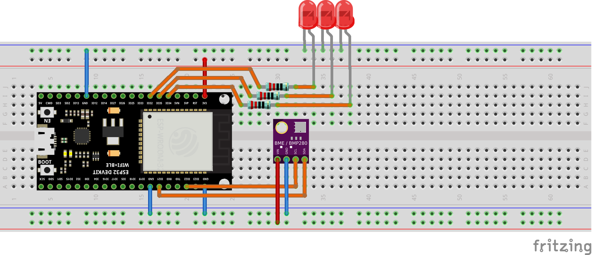

# ThingsBoardDotNet

**ThingsBoardDotNet** is a .Net library designed to work with [ThingsBoard](https://thingsboard.io/) platform and allows you to monitor and control IoT devices. At that moment ThingsBoardDotNet works on the following .Net platforms : 
- .Net Core 3.1
- [.Net nanoFramework](https://nanoframework.net/)

**What is ThingsBoard ?**
ThingsBoard is an open-source IoT platform that enables rapid development, management, and scaling of IoT projects.
We recommend to review [what-is-thingsboard](https://thingsboard.io/) page and [getting-started guide](https://thingsboard.io/docs/getting-started-guides/helloworld/).

**Prerequisites**

Any hardware and software platform compatible with [.Net Core](https://docs.microsoft.com/en-us/dotnet/core/install/) and [.Net nanoFramework](https://github.com/nanoframework/nf-interpreter).

You will need to have ThingsBoard server up and running. The easiest way is to use [Live Demo  ](https://demo.thingsboard.io/signupserver). The alternative option is to install ThingsBoard using [Installation Guide](https://thingsboard.io/docs/user-guide/install/installation-options/).

Sample application code written in C# language, that will connect to ThingsBoard server via MQTT protocol to upload telemetry data and listen to RPC commands. All operations are visualized using a built-in customizable dashboard.

**Simple Weather Station on .Net Core**

In .Net Core application we will not cover sensor drivers and all telemetry data will be emulated by random numbers.

**Simple ESP32 Weather Station With BME280**

We will use an ESP32 Dev Kit board with .Net nanoFramework and BME280 sensor measuring relative humidity, barometric pressure and ambient temperature. 
Also this application will allow you to control GPIO of yours .Net device using ThingsBoard RPC widgets.

**Connection diagram**

The following picture summarizes the connections for this project:



Connect VIN pin to the 3.3V output and connect GND to ground on the ESP32 board. Remaining pins are used for I2C communication. Connect SDA (data line) to IO21 and SCL (clock line) to IO22 on ESP32 board.

**Device provisioning**

This step contains instructions that are necessary to connect your device to ThingsBoard.

Open ThingsBoard Web UI (http://localhost:8080) in browser and login as tenant administrator. If you loaded the demo data during TB installation, the next credentials can be used:

- login: tenant@thingsboard.org
- password: tenant

Go to “Devices” section. Click “+” button and create a device with the name “ESP32 Pico Device”. Set “Device type” to “default”.


Once device created, open its details and click “Manage credentials”.

Copy auto-generated access token from the “Access token” field. Please save this device token. It will be referred to later as **$ACCESS_TOKEN**.


**Provision your dashboard**

Download the dashboard file using this [link](https://thingsboard.io/docs/samples/esp32/resources/esp32-dht22-temp-and-gpio-dashboard.json). Use import/export instructions [instructions](https://thingsboard.io/docs/user-guide/ui/dashboards/#dashboard-importexport) to import the dashboard to your ThingsBoard instance.

**Creating ESP32 firmware**

To get started with nanoFramework, follow [Getting Started](https://docs.nanoframework.net/content/getting-started-guides/getting-started-managed.html) tutorial from nanoFramework website.

Download ThingsBoardDotNet repository from GitHub and open solution in Visual Studio. Open and make default SamplesNanoFramework project. Edit following variables in ThingsBoardGpioAndDHT22Demo.cs file.

```csharp
private static string thingsBoardHost = "demo.thingsboard.io";
private static string thingsBoardAccessToken = "Access_TOKEN";
private static string wifiSSID = "REPLACE-WITH-YOUR-SSID";
private static string wifiApPASSWORD = "REPLACE-WITH-YOUR-WIFI-KEY";
```

 Build and Deploy Solution to the ESP32 board from Visual Studio.

With ThingsBoardDotNet library you can:


Subscribe to ***OnRpcRequestTopic*** event to receive RPC calls from ThingsBoard Platform
```csharp
thingsBoard.OnRpcRequestTopic += OnRpcRequestTopic;
```

The reflection helper class lets you use methods names from c# class as RPC methods called from ThingsBoard.
```csharp
ReflectionHelper.FindRpcMethods(typeof(ThingsBoard_Rpc_and_Telemetry_Demo));
```
Convention names for c# methods can be bypassed by custom attribute ***RpcName***.
```csharp
[RpcName("getGpioStatus")]
public static void GetGpioStatus(TBRpcRequest rpcRequest){}
```

Event handler method will be called when an RPC call is raised from the ThingsBoard application. With reflection helper class RPC name will be found in class either by C# method name or custom attribute ***RpcName***.
```csharp
 private static void OnRpcRequestTopic(object sender, RpcEventArgs e)       
{            
    ReflectionHelper.InvokeRpcMethod(e.RpcRequest);        
}
```
Telemetry publishing
```csharp
TBTelemetry telemetry = new TBTelemetry();
telemetry.Add("temperature", bme280Sensor.ReadTemperature());
telemetry.Add("humidity", bme280Sensor.ReadHumidity());
telemetry.Add("pressure", bme280Sensor.ReadPressure());
                              
thingsBoard.SendTelemetry(telemetry);
```

**Data visualization and GPIO control**

Finally, open ThingsBoard Web UI. You can access this dashboard by logging in as a tenant administrator.

In case of local installation (if the demo data was added during TB installation):

- login: tenant@thingsboard.org
- password: tenant
In case of live-demo server:

login: your live-demo username (email)
password: your live-demo password

Go to **“Devices**” section and locate “**ESP32 Pico Device**”, open device details and switch to “**Latest telemetry**” tab. If all is configured correctly you should be able to see latest values of *“temperature”* and *“humidity”* in the table.


After, open **“Dashboards”** section then locate and open **“ESP32 Pico Dashboard”**. As a result, you will see a time-series chart displaying temperature and humidity level (similar to dashboard image in the introduction).

Once you complete this sample/tutorial, you will see your sensor data on the following dashboard.


You should also observe a GPIO control for your device. It consists of two widgets: one is for controlling LED blink speed (in milliseconds) and second for turning individual LEDs on and off.

You can switch the status of GPIOs using the control panel. As a result, you will see LEDs status change on the device. To control LED blink speed, simply turn a knob and observe a speed change.

.Net nanoFramework and Json.NetMF code credits goes to the [nanoFramework team](https://discord.gg/gCyBu8T).

Thingsboard documentation credits goes to the [ThingsBoard team](https://thingsboard.io/company/).

BME280 driver for .Net nanoFramework credits goes to the [MBNSoftware](https://github.com/MBNSoftware/MBN-TinyCLR) and [Networkfusion](https://github.com/networkfusion/MBN-TinyCLR/blob/develop-nanoframework/nanoFrameworkDriversStatus.md)
